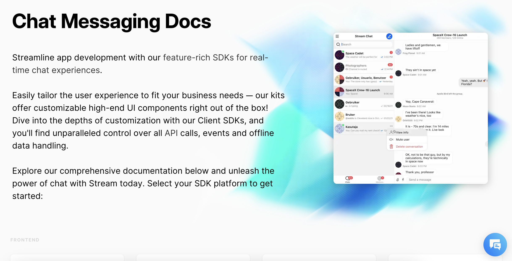

## Who am I?
My name is Niko and the best title I've found for what I do is Developer Experience specialist. I've been a technical writer, product manager, and developer focused on creating great developer experiences for the last decade. I've worked with companies ranging from Fortune 100 sized giants down to teams of 20 people and helped them make the tools, content, and processes that let them unlock the value that their products can bring to developers.

The rest of this page has some examples of the publicly available work that I've done.

## Product Manager of Developer Portals
I've been the product manager of the developer portals for the companies Stream inc and Elavon. During my tenure, I worked alongside designers, developers, and technical writers to create a developer experience that maximized the value of the company's APIs.

### Stream Developer Portal

I spent a year and a half as the product manager of the Stream Developer Portal. I worked with the team to create a developer experience that made it easy for developers to get started with Stream's chat and activity feed APIs.

[See the Stream Developer Portal](https://getstream.io/chat/docs/)

### Elavon Developer Portal

I spent three years as a technical writer and product manager of the Elavon Developer Portal. I worked with the team to move Elavon away from a legacy closed-documentation approach to a modern public developer portal.

[See the Elavon Developer Portal](https://developer.elavon.com/)

## Docs as Tests Contributor
I'm a contributor to the emerging Docs as Tests practice and make tutorial and blog contributions to the [Docs as Tests website](https://www.docsastests.com/)

### How to test an API with Doc Detective

My recent tutorial work includes guides on how to apply Docs as Tests to API products. In this tutorial, I show the basics of setting up Doc Detective to validate an API.

[Read the tutorial](https://www.docsastests.com/validate-api-with-doc-detective)

### Docs as Tests vs Docs as Code

In addition to writing tutorials for Docs as Tests, I also make contributions to the field of practice around Doc Ops. This article discussing how Docs as Tests relates to Docs as Code and where both fit into the broader Doc Ops landscape is one example. 

[Read the article](https://www.docsastests.com/docs-as-tests-vs-docs-as-code)

## Recent Solo Work

### Game score API
As part of school work, I had to put together an API that could track the scores players got in web games. I took a design first approach and wrote the API documentation before writing the code. You can read the Open API reference docs under the API tab of this site.

[Read the API reference](/api-reference)

### Simplest API Ever
As part of recent computer science classwork, I put together the absolute simplest possible API using express and made a tutorial of the process.

[Read the tutorial](/docs/simplest-api)