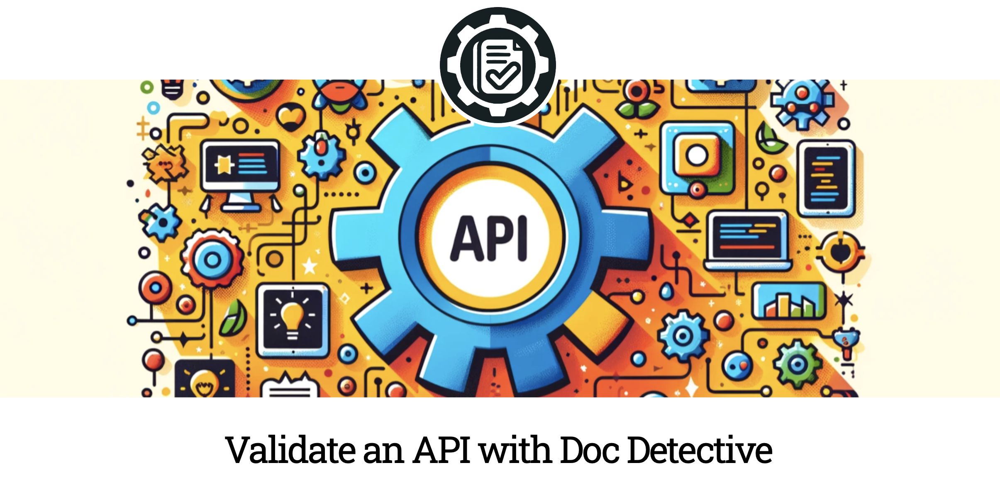
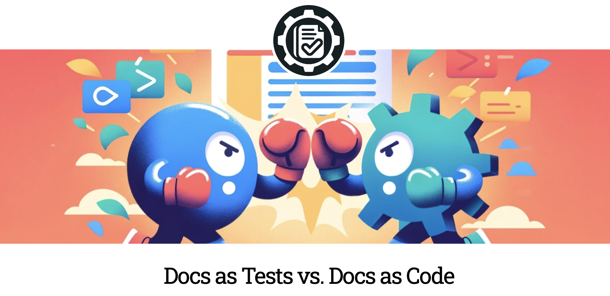

## Product Manager of Developer Portals
I've been the product manager of the developer portals for the companies Stream inc and Elavon. During my tenure, I worked alongside designers, developers, and technical writers to create a developer experience that maximized the value of the company's APIs.

### Stream Developer Portal

[See the Stream Developer Portal](https://getstream.io/chat/docs/)

### Elavon Developer Portal

[See the Elavon Developer Portal](https://developer.elavon.com/)

## Docs as Tests
I'm a contributor to the emerging Docs as Tests practice and make tutorial and blog contributions to the [Docs as Tests website](https://www.docsastests.com/)

### How to test an API with Doc Detective

I wrote a tutorial for Docs as Tests on how to use Doc Detective to test an API. 

[Read the tutorial](https://www.docsastests.com/validate-api-with-doc-detective)

### Docs as Tests vs Docs as Code

An article discussing how Docs as Tests relates to Docs as Code and where both fit into the broader Doc Ops landscape. 

[Read the article](https://www.docsastests.com/docs-as-tests-vs-docs-as-code)

## Recent Solo Work

### Game score API
As part of school work, I had to put together an API that could track the scores players got in web games. I took a design first approach and wrote the API documentation before writing the code. You can read the Open API reference docs under the API tab of this site.

[Read the API reference](/api-reference)

### Simplest API Ever
As part of recent computer science classwork, I put together the absolute simplest possible API using express and made a tutorial of the process.

[Read the tutorial](/simplest-api)